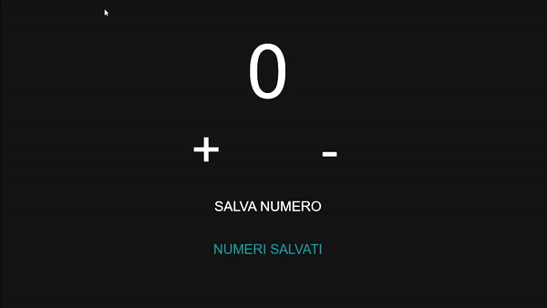

# Progetto Javascript Basics per Start2Impact

## Descrizione

[Demo]("https://francescovicario-javascriptbasics.000webhostapp.com/")

Questa applicazione funge da counter.

Cliccando sui vari bottoni si può:

- Aggiungere e sottrarre di uno;

- Salvare il numero, riportandolo poi a zero, e visionarlo in una sezione apposita.

## Dettagli

Per creare quest'app ho utilizzato **HTML**, **CSS** e **JavaScript**.

I primi due li ho usati per creare la pagina, il terzo invece l'usato per inserire le funzioni da svolgere quando i bottoni sono attivi (le ho implementate con `AddEventListener`). In più, il bottone Numeri Salvati ha al suo interno un `if-else`, di modo che, dal secondo numero salvato in poi, venga aggiunta una virgola e uno spazio prima del numero.
